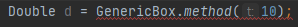

간단하면서 헷갈리는 자바의 제네릭을 정리해 보았다.

1. Generic ?

   먼저 제네릭이란? 자바의 자료형을 매개변수처럼 받아서 이 것을 컴파일시에 체크하여, 구체적인 타입을 결정되도록 한다. 

   같은 클래스에 다른 자료형을 쓰게 되는 경우 Object 타입으로 선언하여, 중간중간 형 변환 과정을 거쳐줘야 하는데 이는 런타임시의 캐스팅 Exception들을 유발할 수 있다.

   하지만 제네릭 사용 시 컴파일시에 구체적인 타입을 지정해버리니 굳이 형변환을 번거롭게 할 이유가 없어진다. 

   이는 제네릭을 사용하지 않을 경우, 실수로 명시적 형변환을 뺄 수 있는 프로그래머의 실수를 방지하는 역할도 한다고 본다.

   

2. Generic Class

   ```class 클래스명<T> {}``` 와 같이 사용한다.

   (참고로 T는 다른 문자여도 상관없으며, 약간의 관습으로 Type의 T, Value의 V, Element의 E를 주로 사용한다.)

   예시를 보자면 다음과 같다.

   ```
   class Box<T> {
   	private T t;
   	public T get() {return t;}
   	public voic set(T t) {this.t = t;}
   }
   ```

   접근 제어자는 다 빼놓고, T를 보면 된다. T는 타입이다. 즉 T type의 t를 멤버로 가지고, Box.get()메서드로 t를 가져올 수 있다. set(T t)로 Box의 t를 결정할 수 있다.

   이 때 Box 클래스의 T는 모든 타입이 될 수 있는 것이다. 가령, Integer든, Object든, Potato든 어떤 타입이라도 가질 수 있다. 이를 main method에서 사용할 때 명시만 해주면 된다.

   ```
   Box<Integer> box = new Box<Integer>();
   // Box<Integer> box = new Box<>();와 같이 사용할 수 있다. 
   // 다만 이는 jdk1.7부터 가능하다.
   ```

   

   너무도 쉽고 간단한데. 도대체 어디서 헷갈렸는가? 바로 제네릭 메서드이다.

   ```
   public static <T extends Comparable<? super T>> void sort (List<T> list) {}
   ```

   Collections의 sort메서드이다. 구현부는 패스하고, 선언부만 봐도 이상하다. (참고로 본인이 헷갈렸던 것은 와일드카드와 같은 부분이 아니므로 넘어간다! 짧게 설명하자면 Comparable을 구현한 T만 가능하게 제한을 걸어놓은 것이고, 이 때 Comparable의 제네릭은 T의 상위 객체들만 가능하게. 즉 T의 자식 객체로 만든 Comparable은 불가능하게끔 제한을 걸어놓은 것이다. 짧게 설명하자고 했지만 길어졌다.)

   T타입으로 반환하는건가? T는 Comparable을 상속받는거 같고.. 왜 implements를 쓰지 않았는지는 잘 모르겠네. 그런데 Comparable에 제네릭이 또붙네? 물음표는 뭐고 super는 부모 객체를 찾는 거아닌가? T는 또 뭐야. 어라 근데 반환타입은 또 void네? 이건 도대체 뭘까?

   대충 처음 본 상태에서 의식의 흐름이었다. return 타입인줄 알았더니? return 타입은 void이다. 그럼 도대체 뭐하는놈이고 왜필요한거지?

   

   제네릭 메서드의 제네릭은 사실 클래스와 별 반 다를 것 없다. 단지 메서드에서 쓰일 변수들과 return 타입으로 쓰일 수 있는 타입을 지정한다.

   즉, public <T> T method(T t) {} 와 같이 선언한다면,
   class.<Integer>method(10); 과 같은 형태로 쓸 수 있다는 것이다.

   여기서 재밌는 점은, method의 매개변수로 해당 메서드의 제네릭이 얼추 파악이 가능하기 때문에
   class.method(10)과 같이 써도 아무런 문제가 발생하지 않는다.

   그럼 궁금한 점이 생긴다. Integer로 넣었는데 Double형으로 받으면 어떨까?

   

   깔끔하게 컴파일 오류가 떠주었다. 즉, 리턴타입과 매개변수의 타입은 고정이 되었다는 사실을 알 수 있다.

   혼자서 굉장히 헷갈려했던 것이 있다.

   ```
   class gTest<T> {
       private T t;
       private <T> T method(T t) {}
   }
   ```

   과연 이렇게 쓰는 소스가 괜찮은지. 는 나중에 생각해보도록 하고, (물론 이해를 하고 나니까 가독성에 큰 문제는.. 없을 것 같다는 생각을 했다.) 이렇게 쓴다면 메서드의 T는 클래스의 제네릭 T인지, 메서드의 제네릭 T인지. 도대체 누구일까?

   

   답을 알기 위해 해봤던 것은 바로 this.t이다. this.t는 확실하게 클래스의 제네릭 T 타입을 가질 것이고, 메서드의 t는 어떤 타입인지 알 수없는 상태이다. 즉 매개변수로 판단할 수 있다. 

   ```
   private <T> void method(T t) {this.t = t;}
   ```

   재밌게도, 컴파일 오류가 났다. 요구하는 자료형과 다르다고 한다. 왜 다를까? this.t는 클래스, t는 메서드의 자료형을 따라간다는 것을 알 수 있었다.  그러므로, 아래와 같은 소스는 오류가 나지 않는다.

   ```
   class gTest<E> {
       private E e;
       private <T> void method(T t) {this.e = (E)t;}
   }
   ```

   당연하게도, 아래와 같은 소스는 컴파일 오류가 발생한다.

   ```
   class gTest<T> {
       private T t;
       private <T> void method(T t) {this.t = (T)t;}
   }
   ```

   즉, 제네릭 메서드의 타입들은 모두 메서드의 선언부에 있는 제네릭을 따라간다는 것을 확인할 수 있었다.

   따라서, 클래스의 제네릭과 메서드의 제네릭이 동일하다면 위와 같이 형변환이 불가능하다. 다르면 가능하다. (당연한 이야기지만) 


제네릭 메서드에 대해 헷갈렸던 점을 이해를 했다. 사실 이렇게 이해하는데 오래 걸릴 문제도 아니였던 것 같은데, 그냥 헷갈렸다. 이런 생각도 해봤었다. ```public <T> T<T> method(T<T> t) {}``` 같은 메서드도 만들 수 있는건가? (T가 \<T\>를 가질 수 있는지 모르기 때문에 뭐.. 당연히 오류가 날 것 같다. T가 제네릭을 가지고있다고 알려줄 방법이 있나?)

하여간, 완벽하게 짚고 넘어가서 좀 후련하고, 개인적으로 이걸 이해하는 과정이 나름 재밌었다고 생각되기에 글로 남긴다. 혹시 비슷한 이유로 헷갈리는 분들이 있다면 쉽게 이해하고 넘어갈 수 있을거라 생각한다. 사실 나처럼 헷갈렸다는 사람이 몇이나 될지는 모르겠다. 뭐 하나 제대로 정독했으면 금방 넘어갔을지도...

> 결론!
>
> 제네릭도 지역변수처럼 가까운 곳을 본다. 제네릭 클래스의 제네릭 메서드에 둘다 같은 문자의 제네릭이라면, 제네릭 메서드의 문자만 보면 된다. 
>
> 그런데 굳이 같은 문자로 해야 될까? 그렇다고 같은 문자를 사용한다고 해서 가독성이 떨어지는걸까? 이 부분은 고민을 해봐야 할 것 같다.